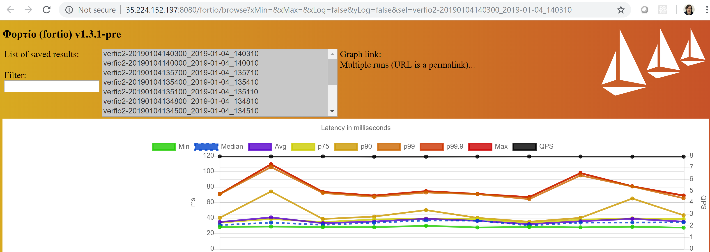

## Overview

The goal of [this project][fortio-operator] is to provide an excellent automation experience for load testing activities within the Kubernetes cluster and outside of it.

This project is based on the [Operator Framework][of-home], an open source toolkit to manage Kubernetes native applications, called Operators, in an effective, automated, and scalable way. Read more in the [introduction blog post][of-blog].

[Fortio][fortio-home] is a load testing tool.
Fortio runs at a specified query per second (qps) and records an histogram of execution time and calculates percentiles. It can run for a set duration, for a fixed number of calls, or until interrupted (at a constant target QPS, or max speed/load per connection/thread). 

## Installation

Run this command to deploy the operator
```sh
$ kubectl create -f https://raw.githubusercontent.com/verfio/fortio-operator/master/deploy/fortio.yaml
customresourcedefinition.apiextensions.k8s.io "crontests.fortio.verf.io" created
customresourcedefinition.apiextensions.k8s.io "servers.fortio.verf.io" created
customresourcedefinition.apiextensions.k8s.io "loadtests.fortio.verf.io" created
customresourcedefinition.apiextensions.k8s.io "curltests.fortio.verf.io" created
customresourcedefinition.apiextensions.k8s.io "testruns.fortio.verf.io" created
serviceaccount "fortio-operator" created
clusterrolebinding.rbac.authorization.k8s.io "fortio-operator" created
role.rbac.authorization.k8s.io "fortio-operator" created
rolebinding.rbac.authorization.k8s.io "fortio-operator" created
deployment.apps "fortio-operator" created
configmap "fortio-data-dir" created
```
Verify that fortio-operator pod is up and running

```sh
$ kubectl get pods
NAME                              READY     STATUS    RESTARTS   AGE
fortio-operator-8fdc6d967-ssjk4   1/1       Running   0          33s
```

## CurlTest
Create CurlTest resource and define expected response if needed, like [this YAML][fortio-curltest] 

```yaml
apiVersion: fortio.verf.io/v1alpha1
kind: CurlTest
metadata:
  name: verfio
spec:
  url: "https://verf.io"
  lookForString: "VERF.IO"
```

Below you can find a list of parameters you can use right now for CurlTest and their allowed values. For complete documentation of these parameters please refer to [Fortio][fortio-home].
Please define all values in yaml files as string even if allowed value is int(e.g. "10" instead of 10). 

Field name       | Mandatory? | Allowed values  | Description
----------       | ---------- | ----------------| ----------------
url              | Yes        | URL             | URL of the site you want to test
lookForString    | Yes        | string          | Should be without spaces
method           | No         | POST            | Set this to POST to switch from GET, any other value will be ignored
contentType      | No         | string          | Sets http content type
payload          | No         | string          | Payload string to send along
payloadSize      | No         | int             | Additional random payload size
maxPayloadSizeKB | No         | int             | Maximum size of payload to be generated by the
EchoHandler size= argument. In Kbytes. (default 256)
payloadFile      | No         | string          | File path to be use as payload
payloadConfigMap | No*        | string          | Name of configMap where payloadFile is stored,  mandatory if payloadFile is used.
logLevel         | No         | string          | One of [Debug Verbose Info Warning Error Critical Fatal]

Here is an example yaml to create configMap:

```yaml
apiVersion: v1
data:
  {NAME OF YOUR PAYLOADFILE}: |
    Test data
    Test data
    Test data
kind: ConfigMap
metadata:
  name: {NAME OF YOUR CONFIGMAP}
```

Apply this file:

```sh
$ kubectl apply -f https://raw.githubusercontent.com/verfio/fortio-operator/master/deploy/crds/fortio_v1alpha1_curltest_cr.yaml
curltest.fortio.verf.io "verfio" created
```

Check the result using the describe command:

```sh
$ kubectl describe curltest
Name:         verfio
Namespace:    default
Labels:       <none>
API Version:  fortio.verf.io/v1alpha1
Kind:         CurlTest
Spec:
  Look For String:  VERF.IO
  URL:              https://verf.io
Status:
  Condition:
    Result:  Success
Events:      <none>
```
As we found that resource is available, let's fire the loadtest.

## LoadTest

Create LoadTest resource and define desired conditions. For example, [this YAML][fortio-loadtest] says that we want to test the https://verf.io for 10 seconds:

```yaml
apiVersion: fortio.verf.io/v1alpha1
kind: LoadTest
metadata:
  name: verfio
spec:
  duration: 10s
  url: "https://verf.io"
  action: load
```

Below you can find a list of parameters you can use right now for LoadTest and their allowed values. For complete documentation of these parameters please refer to [Fortio][fortio-home].
Please define all values in yaml files as string even if allowed value is int(e.g. "10" instead of 10). 

Field name       | Mandatory? | Allowed values  | Description
----------       | ---------- | ----------------| ----------------
url              | Yes        | URL             | URL of the site you want to test
duration         | Yes        | duration        | How long to run the test or 0 to run until ^C (default 5s)
header           | Yes        | string          | Additional header(s). Only one header is allowed right now
user             | Yes        | string          | User credentials for basic authentication (for http)
password         | Yes        | string          | User credentials for basic authentication (for http)
qps              | Yes        | float           | Queries Per Seconds or 0 for no wait/max qps (default 8)
threads          | Yes        | int             | Number of connections/goroutine/threads (default 4)
method           | No         | POST            | Set this to POST to switch from GET, any other value will be ignored
contentType      | No         | string          | Sets http content type
payload          | No         | string          | Payload string to send along
payloadSize      | No         | int             | Additional random payload size
maxPayloadSizeKB | No         | int             | Maximum size of payload to be generated by the
EchoHandler size= argument. In Kbytes. (default 256)
payloadFile      | No         | string          | File path to be use as payload
payloadConfigMap | No*        | string          | Name of configMap where payloadFile is stored,  mandatory if payloadFile is used.
logLevel         | No         | string          | One of [Debug Verbose Info Warning Error Critical Fatal]

Apply this file:

```sh
$ kubectl apply -f https://raw.githubusercontent.com/verfio/fortio-operator/master/deploy/crds/fortio_v1alpha1_loadtest_cr.yaml

loadtest.fortio.verf.io "verfio" created
```
Verify that Job to run the LoadTest is created and Pod has successfully completed the required task:

```sh
$ kubectl get jobs
NAME         DESIRED   SUCCESSFUL   AGE
verfio-job   1         1            4m

$ kubectl get pods
NAME                              READY     STATUS      RESTARTS   AGE
fortio-operator-8fdc6d967-ssjk4   1/1       Running     0          15m
verfio-job-v8wl6                  0/1       Completed   0          5m
```

When test is finished, the result will be stored in the `fortio-data-dir` configmap:

```sh
$ kubectl get cm
NAME                   DATA      AGE
fortio-data-dir        1         19m
fortio-operator-lock   0         19m
```
Check the content of this data (output omitted):

```sh
$ kubectl describe cm fortio-data-dir
verfio_2018-12-22_155126.json:
----
{
  "RunType": "HTTP",
  "Labels": "verf.io , verfio-job-v8wl6",
  "StartTime": "2018-12-22T15:51:10.053834734Z",
  "RequestedQPS": "8",
  "RequestedDuration": "10s",
  "ActualQPS": 7.970731756747274,
  "ActualDuration": 10036719644,
  "NumThreads": 4,
  "Version": "1.3.1-pre",
  "DurationHistogram": {
    "Count": 80,
    "Min": 0.028049263,
    "Max": 0.073276722,
    "Sum": 2.9869050279999994,
    "Avg": 0.03733631284999999,
    "StdDev": 0.013932356831744559,
    "Data": [
      {
        "Start": 0.028049263,
        "End": 0.03,
        "Percent": 25,
        "Count": 20
      },
      {
        "Start": 0.03,
        "End": 0.035,
        "Percent": 72.5,
        "Count": 38
      },
      ...
```
Also, you can observe the result in the Status field of LoadTest resource:
```sh
$ kubectl describe loadtest
Name:         verfio
Namespace:    default
Labels:       <none>
API Version:  fortio.verf.io/v1alpha1
Kind:         LoadTest
Metadata:
Spec:
  Action:    load
  Duration:  10s
  URL:       https://verf.io
Status:
  Condition:
    50 %:      0.045
    75 %:      0.052
    90 %:      0.0666667
    99 %:      0.101175
    99 . 9 %:  0.105407
    Avg:       45.845ms
    Qps:       7.9318
    Result:    Success
Events:        <none>
```

## TestRun

TestRun is suitable in case when you need to define a set of different tests, for example, [this YAML][fortio-testrun] defines a set of four tests in a given order: 
```yaml
apiVersion: fortio.verf.io/v1alpha1
kind: TestRun
metadata:
  name: verfio
spec:
  curl:
  - order: "10"
    url: "https://verf.io"
  - order: "15"
    url: "https://verf.io"
    method: "POST"
  load:
  - order: "20"
    url: "https://verf.io"
    duration: 10s
  - order: "30"
    url: "https://www.verf.io"
    duration: 30s
```
Apply this file 
```sh
$ kubectl apply -f https://raw.githubusercontent.com/verfio/fortio-operator/master/deploy/crds/fortio_v1alpha1_testrun_cr.yaml
testrun.fortio.verf.io "verfio" created
```
Wait for a while and verify the list of CurlTest resources:
```sh
$ kubectl get curltest
NAME                          AGE
testrun-verfio-10-curl-test   1m
testrun-verfio-15-curl-test   1m
```
Wait a couple of minutes and get the list of LoadTest resources:
```sh
$ kubectl get loadtest
NAME                          AGE
testrun-verfio-20-load-test   1m
testrun-verfio-30-load-test   1m
```
For each test the dedicated pod was provisioned:
```sh
$ kubectl get pods
NAME                                             READY     STATUS      RESTARTS   AGE
curltest-testrun-verfio-10-curl-test-job-kldl8   0/1       Completed   0          3m
curltest-testrun-verfio-15-curl-test-job-sjnx7   0/1       Completed   0          2m
fortio-operator-6f7c799db5-kpfc7                 1/1       Running     0          4m
loadtest-testrun-verfio-20-load-test-job-tc6mz   0/1       Completed   0          2m
loadtest-testrun-verfio-30-load-test-job-x6w8f   0/1       Completed   0          1m
```
Let's take a look whether testrun-verfio-30-load-test was successful:

```sh
$ kubectl describe loadtest testrun-verfio-30-load-test
Name:         testrun-verfio-30-load-test
Namespace:    default
Labels:       app=verfio
Annotations:  <none>
API Version:  fortio.verf.io/v1alpha1
Kind:         LoadTest
...
Status:
  Condition:
    50 %:      0.0313991
    75 %:      0.0341514
    90 %:      0.0389773
    99 %:      0.107333
    99 . 9 %:  0.126325
    Avg:       34.243ms
    Qps:       7.9956
    Result:    Success
Events:        <none>
```
To analyze results provided by various tests, as part of single TestRun, or as separated tests, it could be very useful to visualize them. We can use the Server resource to make it possible.

## Server 
Run this command to instruct the fortio-operator to spin up the server:
```sh
$ kubectl apply -f https://raw.githubusercontent.com/verfio/fortio-operator/master/deploy/crds/fortio_v1alpha1_server_cr.yaml
server.fortio.verf.io "fortio-server" created
```
Check IP address of Server:
```sh
$ kubectl get service fortio-server
NAME            TYPE           CLUSTER-IP     EXTERNAL-IP      PORT(S)          AGE
fortio-server   LoadBalancer   10.27.255.49   IP_ADDRESS   8080:30269/TCP   1m
```
Navigate to specified address: http://IP_ADDRESS:8080/fortio/ to see the Fortio's UI and to http://IP_ADDRESS:8080/fortio/browse to see the list of saved results. Pick the existing one from the list and you will see the fancy diagram.

if LoadBalancer Service type is not supported by your Kubernetes cluster, you are able to expose UI via NodePort, like:
```yaml
apiVersion: fortio.verf.io/v1alpha1
kind: Server
metadata:
  name: fortio-server
spec:
  type: NodePort
```
Also, you are able to update current Server type via `kubectl edit server` command. 
For example, change LoadBalancer to NodePort and Kubernetes Service will be updated:
```sh
$ kubectl get svc
NAME            TYPE           CLUSTER-IP      EXTERNAL-IP       PORT(S)                      AGE
fortio-server   LoadBalancer   10.11.255.200   104.155.157.141   8080:32575/TCP               1h
$ kubectl edit server                                                                         
server.fortio.verf.io "fortio-server" edited
$ kubectl get svc
NAME            TYPE           CLUSTER-IP      EXTERNAL-IP      PORT(S)                      AGE
fortio-server   NodePort       10.11.255.200   <none>           8080:32575/TCP               1h
``` 

Currently, Server.Spec allows to configure only single value:

Field name| Mandatory? | Allowed values                    | Description
----------| ---------- | ----------------------------------|-----------------
type      | No         | LoadBalancer or NodePort (default)| How to expose the UI

## CronTest

CrontTest is useful when you need to setup the schedule for CurlTest, LoadTest or TestRun.
For example, [this YAML][fortio-crontest] asks Operator to execute CurlTest every 1 minute, LoadTest every 3 minutes and TestRun every 10 minutes, every day starting from 0:00:00: 

```yaml
apiVersion: fortio.verf.io/v1alpha1
kind: CronTest
metadata:
  name: verfio1
spec:
  schedule: "0 * * * * *"
  curl:
    url: "https://verf.io"
    lookForString: "VERF.IO"
---
apiVersion: fortio.verf.io/v1alpha1
kind: CronTest
metadata:
  name: verfio2
spec:
  schedule: "0 */3 * * * *"
  load:
    url: "https://verf.io"
    lookForString: "VERF.IO"
---
apiVersion: fortio.verf.io/v1alpha1
kind: CronTest
metadata:
  name: verfio3
spec:
  schedule: "0 */10 * * * *"
  testRun:
    curl:  
    - url: "https://verf.io"
      order: "10"
    load:
    - url: "https://verf.io"
      order: "20"
```
To specify the schedule you just need to leverage the cron-like expressions:

Field name   | Mandatory? | Allowed values  | Allowed special characters
----------   | ---------- | --------------  | --------------------------
Seconds      | Yes        | 0-59            | * / , -
Minutes      | Yes        | 0-59            | * / , -
Hours        | Yes        | 0-23            | * / , -
Day of month | Yes        | 1-31            | * / , - ?
Month        | Yes        | 1-12 or JAN-DEC | * / , -
Day of week  | Yes        | 0-6 or SUN-SAT  | * / , - ?

Run this command to schedule our tests:

```sh
$ kubectl apply -f https://raw.githubusercontent.com/verfio/fortio-operator/master/deploy/crds/fortio_v1alpha1_crontest_cr.yaml
crontest.fortio.verf.io "verfio1" created
crontest.fortio.verf.io "verfio2" created
crontest.fortio.verf.io "verfio3" created
```

Wait for a while and you should see similar results:

```sh
$ kubectl get curltest
NAME                                          AGE
testrun-verfio3-20190104132000-10-curl-test   1m
verfio1-20190104130600                        15m
verfio1-20190104130700                        14m
verfio1-20190104130800                        13m
verfio1-20190104130900                        12m
verfio1-20190104131100                        10m
verfio1-20190104131200                        9m
verfio1-20190104131300                        8m
verfio1-20190104131400                        7m
verfio1-20190104131500                        6m
verfio1-20190104131600                        5m
verfio1-20190104131700                        4m
verfio1-20190104131800                        3m
verfio1-20190104131900                        2m
verfio1-20190104132000                        1m
verfio1-20190104132100                        43s
$ kubectl get loadtest
NAME                                          AGE
testrun-verfio3-20190104132000-20-load-test   1m
verfio2-20190104130600                        15m
verfio2-20190104130900                        12m
verfio2-20190104131200                        9m
verfio2-20190104131500                        6m
verfio2-20190104131800                        3m
verfio2-20190104132100                        48s
$ kubectl get testrun
NAME                     AGE
verfio3-20190104132000   1m

$ kubectl get pods
NAME                                                             READY     STATUS      RESTARTS   AGE
curltest-testrun-verfio3-20190104132000-10-curl-test-job-fg4gn   0/1       Completed   0          3m
curltest-verfio1-20190104130600-job-rfcc2                        0/1       Completed   0          18m
curltest-verfio1-20190104130700-job-9k7xt                        0/1       Completed   0          17m
curltest-verfio1-20190104130800-job-6snll                        0/1       Completed   0          16m
curltest-verfio1-20190104130900-job-tqxkn                        0/1       Completed   0          15m
curltest-verfio1-20190104131100-job-6465d                        0/1       Completed   0          13m
curltest-verfio1-20190104131200-job-ng2js                        0/1       Completed   0          12m
curltest-verfio1-20190104131300-job-9vkff                        0/1       Completed   0          11m
curltest-verfio1-20190104131400-job-nzj85                        0/1       Completed   0          10m
curltest-verfio1-20190104131500-job-5hkr7                        0/1       Completed   0          9m
curltest-verfio1-20190104131600-job-np2k6                        0/1       Completed   0          8m
curltest-verfio1-20190104131700-job-2plr6                        0/1       Completed   0          7m
curltest-verfio1-20190104131800-job-cq7dm                        0/1       Completed   0          6m
curltest-verfio1-20190104131900-job-zd29h                        0/1       Completed   0          5m
curltest-verfio1-20190104132000-job-62b9d                        0/1       Completed   0          4m
curltest-verfio1-20190104132100-job-j5bzj                        0/1       Completed   0          3m
curltest-verfio1-20190104132200-job-z54tm                        0/1       Completed   0          2m
curltest-verfio1-20190104132300-job-fm56q                        0/1       Completed   0          1m
curltest-verfio1-20190104132400-job-d7h2f                        0/1       Completed   0          6s
fortio-operator-8fdc6d967-fq9l2                                  1/1       Running     0          14m
loadtest-testrun-verfio3-20190104132000-20-load-test-job-42pfn   0/1       Completed   0          3m
loadtest-verfio2-20190104130600-job-vhw6q                        0/1       Completed   0          18m
loadtest-verfio2-20190104130900-job-cfjcc                        0/1       Completed   0          15m
loadtest-verfio2-20190104131200-job-g9f2w                        0/1       Completed   0          12m
loadtest-verfio2-20190104131500-job-vxsj5                        0/1       Completed   0          9m
loadtest-verfio2-20190104131800-job-cjjdr                        0/1       Completed   0          6m
loadtest-verfio2-20190104132100-job-v25bz                        0/1       Completed   0          3m
loadtest-verfio2-20190104132400-job-9jzjh                        1/1       Running     0          6s
```

The best way to analyze the scheduled test is to provision Server resource, navigate to UI and select the set of saved results from the list:



## Clean up

Delete CronTests

```sh
$ kubectl delete crontest verfio1
crontest.fortio.verf.io "verfio1" deleted
$ kubectl delete crontest verfio2
crontest.fortio.verf.io "verfio2" deleted
$ kubectl delete crontest verfio3
crontest.fortio.verf.io "verfio3" deleted
```

Delete Server
```sh
kubectl delete server fortio-server
server.fortio.verf.io "fortio-server" deleted
```

Delete CurlTest
```sh
kubectl delete curltest verfio
curltest.fortio.verf.io "verfio" deleted
```

Delete LoadTest
```sh
kubectl delete loadtest verfio
loadtest.fortio.verf.io "verfio" deleted
```

Delete TestRun
```sh
kubectl delete testrun verfio
testrun.fortio.verf.io "verfio" deleted
```

Delete Operator:
```sh
kubectl delete -f https://raw.githubusercontent.com/verfio/fortio-operator/master/deploy/fortio.yaml
customresourcedefinition.apiextensions.k8s.io "crontests.fortio.verf.io" deleted
customresourcedefinition.apiextensions.k8s.io "servers.fortio.verf.io" deleted
customresourcedefinition.apiextensions.k8s.io "loadtests.fortio.verf.io" deleted
customresourcedefinition.apiextensions.k8s.io "curltests.fortio.verf.io" deleted
customresourcedefinition.apiextensions.k8s.io "testruns.fortio.verf.io" deleted
serviceaccount "fortio-operator" deleted
clusterrolebinding.rbac.authorization.k8s.io "fortio-operator" deleted
role.rbac.authorization.k8s.io "fortio-operator" deleted
rolebinding.rbac.authorization.k8s.io "fortio-operator" deleted
deployment.apps "fortio-operator" deleted
configmap "fortio-data-dir" deleted
```


[of-home]: https://github.com/operator-framework
[of-blog]: https://coreos.com/blog/introducing-operator-framework
[fortio-home]: https://github.com/fortio/fortio
[fortio-operator]: https://github.com/verfio/fortio-operator
[fortio-loadtest]: https://raw.githubusercontent.com/verfio/fortio-operator/master/deploy/crds/fortio_v1alpha1_loadtest_cr.yaml
[fortio-curltest]: https://raw.githubusercontent.com/verfio/fortio-operator/master/deploy/crds/fortio_v1alpha1_curltest_cr.yaml
[fortio-testrun]: https://raw.githubusercontent.com/verfio/fortio-operator/master/deploy/crds/fortio_v1alpha1_testrun_cr.yaml
[fortio-crontest]:https://raw.githubusercontent.com/verfio/fortio-operator/master/deploy/crds/fortio_v1alpha1_crontest_cr.yaml
